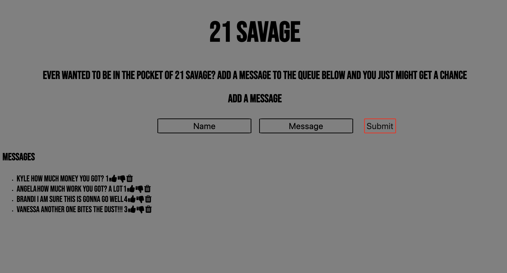

# 21 Savage Fan Site

## Goal: Create a web application where users can add fan messages to a message board. Users can then up vote, down vote a message or delete messages.

Technologies Used:
- ejs
- javascript
- nodejs
- css
- mongoDB

## Installation

1. Clone repo
2. run `npm install`

## Usage

1. run `npm run savage`
2. Navigate to `localhost:3000`
